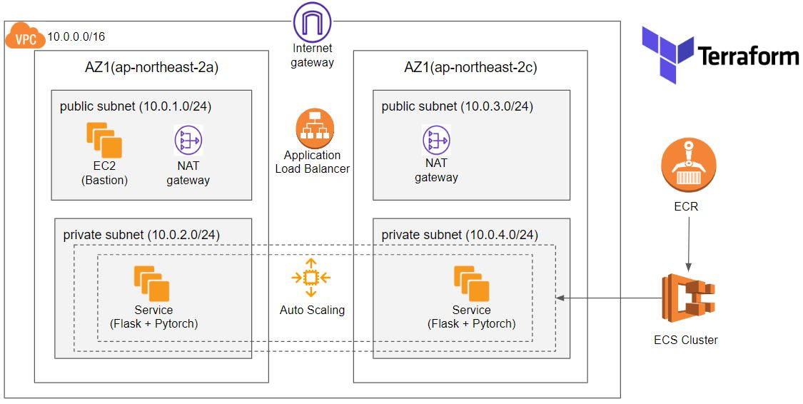
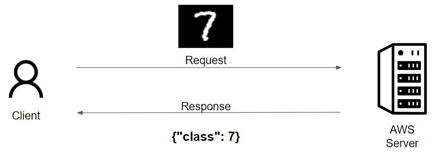
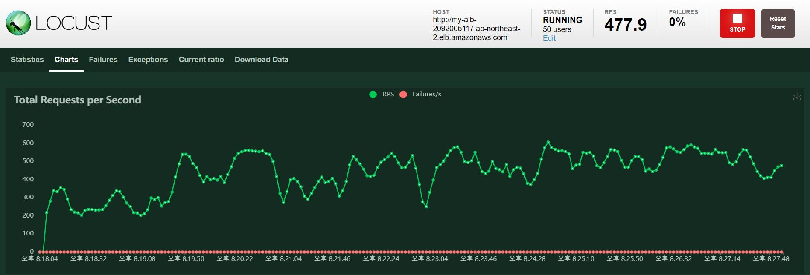
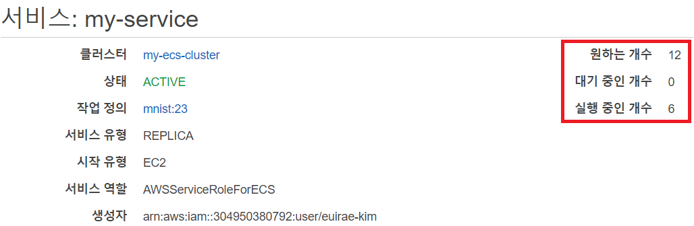
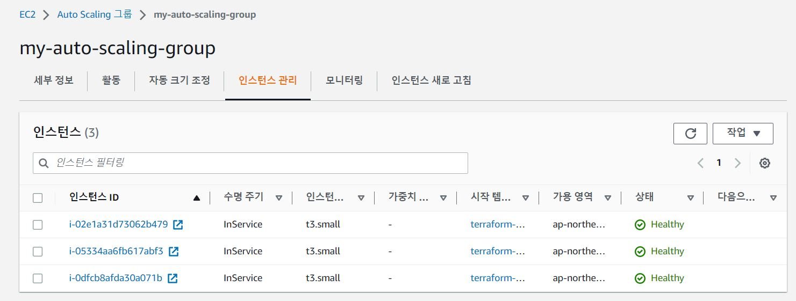
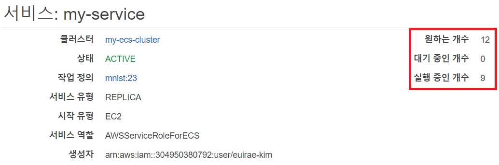

# terraform-ecs-mnist-serving

<br/><br/>

# 서버 아키텍쳐 및 통신 구조



<br/><br/>



<br/><br/>

# 사전 조건
terraform과 aws cli 등 terraform 코드로 aws를 제어할 환경이 세팅되어있어야한다.

<br/>

# 폴더 구조

* terraform/ : 모든 서버 아키텍쳐를 구성하는 테라폼 코드
* server/ : Pytorch 모델을 서빙하는 Flask 서버 관련 코드
* test_images/ : 서버 테스트시 보낼 샘플 손글씨 이미지
* imgs/ : README.md에 들어갈 이미지
* load_test.py : locust 모듈로 stress test를 하는 코드
* push-ecr.sh : ECR에 로그인 / 이미지 빌드 / 푸시를 하는 순차적인 명령어 파일
* train.ipynb : Pytorch 프레임워크로 모델을 학습하는 노트북 코드

<br/><br/>

# 테라폼으로 AWS 리소스 생성

```bash
cd terraform/
```

<br/>

## Terraform Backend로 사용할 S3, DynamoDB 생성

```bash
cd init/
terraform init
terraform apply
cd ../
```

<br/>

## Terraform 모든 리소스 생성 (VPC, ECS, ECR 등)

```bash
terraform init
terraform apply
cd ../
```

<br/><br/>

# 이미지 빌드 후 ECR로 푸시

```bash
bash push-ecr.sh AWS_REGION AWS_ACCOUNT_ID REPOSITORY_NAME
```
이미지 푸시 후 시간이 조금 지나면 ECS에 의해 관리가 시작되고 컨테이너가 생성되고 로드밸런서 헬스체크까지 완료된다.

<br/><br/>

# Locust를 사용한 로드테스트
먼저 로드밸런서의 도메인 네임을 load_test.py 코드의 host 부분에 넣어준다.

<br/>

## locust 설치
```bash
pip install locust
```
<br/>

## locust 서버 구동
```bash
locust -f load_test.py
```

<br/>

http://localhost:8089/ (locust 접속 링크)로 접속 후 로드테스트


요청이 초당 수백개씩 들어감

<br/><br/>

# Auto scaling 확인
로드 테스트가 진행됨에 따라 두 가지의 오토스케일링을 확인할 수 있음
* 서비스(컨테이너) 수준 오토스케일링
* 클러스터(노드) 수준 오토스케일링

<br/>

## 1. 서비스 수준 오토스케일링
* 실행 컨테이너가 초깃값인 __2개__ 에서 CPU 조건에 따라 __6개__ 로 늘어남  
* EC2 노드의 수가 초깃값인 __2개__ 인 상태에서는 컨테이너가 __6개__ 밖에 들어갈 수 없기 때문이다.



## 2. 클러스터 수준 오토스케일링
* 컨테이너 __6개__ 인 상태에서 점점 요청량이 늘어나면 클러스터 수준에서 오토스케일링 작동
* EC2 노드의 개수가 초깃값인 2개에서 3개로 늘어난 것을 확인



## 3. 서비스 수준 오토스케일링
* EC2 노드가 늘어나 컨테이너가 들어갈 자리가 생기자 실행 컨테이너 개수가 __6개__ 에서 __9개__ 로 늘어남
* 이와 같은 방식으로 이보다 훨씬 많은 요청에도 점진적으로 대응할 수 있을 것으로 예상

